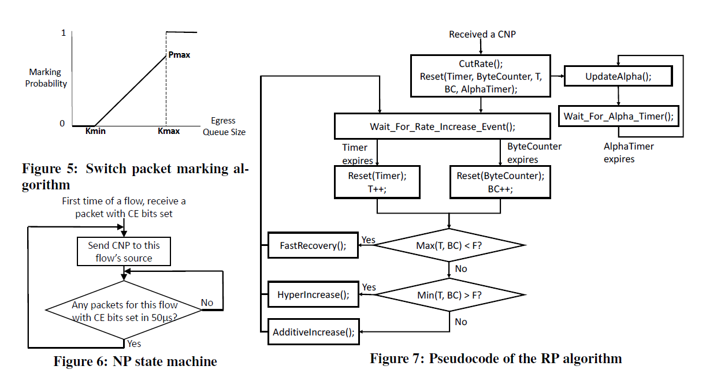

## 概述
这篇论文主要是针对RDMA拥塞控制算法DCQCN的一个阐述。PFC是一种粗粒度的基于端口级别的拥塞控制，因为不是基于流的，会导致Unfairness和Victim flow等问题，为解决此类问题，作者建立了一个流体模型，并提供了调整开关缓冲区阈值和其它协议参数的指南。

## 为何需要DCQCN
- 传统内核态TCP/IP协议臃肿复杂，占用CPU资源多、延时大、启动较慢、流控保守，对于东西向网络局限性很大。因此引入RDMA绕过内核来缩减延迟和CPU开销。为了简化设计和实现，RDMA采用了无损网络模型。 
- 而无损网络就要引入PFC算法（优先级流量控制）； PFC是通过ingress端口提前发送PAUSE报文来通知发送方暂停发送，以此来避免缓冲区溢出丢失报文带来回退重发的巨大开销。 但是在大规模网络上引入PFC会带来两个潜在的问题：
  - 1. Unfairness： 不同的端口因为共享发送者数目不一样，所以分得的流量不一样。
  - 2. Victim flow：暂停帧具有级联效果，因此不在拥塞路径上的流也会被误伤暂停。 
    - 和拥塞端口在同一NIC上的端口会受影响
    - 由于中间路由器被限速，因此影响到其它服务节点的吞吐  
- 之所以产生是因为PFC基于端口，不能区分流，粒度太大；解决方案：使用端到端基于流的拥塞控制，也就是DCQCN。  
```小结：由于PFC的拥塞扩散特性，RoCEv2的流量可能会看到较低的吞吐，并且大面积的抖动```

## DSQCN算法
- DCQCN是基于速率和反馈式的拥塞控制、它的基本思路是：
`发送方（RP）以最高速开始发送，沿途过程中如果有拥塞，报文会被标记ECN显示拥塞，当该报文被发送到接收方（NP）的时候，接收方（NP）会回应一个CNP包通知到发送方（RP）。收到CNP报文的发送方（RP）开始降速，当一段时间发送方没有收到CNP包，就开始提速。`

- 算法设计：
  - 中继端-Congestion Point（拥塞点）：概率性的在数据包上打ECN标记，发送ECN的队列长度阈值要小于PFC的阈值，以尽可能避免PFC，因为后者将彻底暂停上游端口发送报文，概率阈值见图4所示
  - 接收端-Notification Point（通知点）: 当通知点接受到数据包时，它会检查ECN标记，如果50us内没有发送过CNP(拥塞通知分组)，那它会向发送端发送CNP，通知发送者控制流速。
  - 发送端-Reaction Point（反应点）：当流量发送端接收到CNP时，它会按比例减少流量，该比例的计算类似于DCTCP，当接收到CNP时，流控比例增加，当CNP变少时，流控比降低以提升发送速度。公式如下：  
  ```
      Rt = Rc;            //Rt把当前速率作为恢复目标
      Rc = Rc*(1 - a/2);  //限速调整Rc，a是一个加权的限速因子
      a = (1-g)*a + g;    //如果RP超过时长K(55us) 没有收到CNP，那它就更新a参数: a = (1-g)*a，其实也就是进一步降低该值
  ```  
      
  - 在恢复阶段，RP会增加它的发送速率, 主要是看两个指标一个是时长T，另一个是累计发送字节数B，连续在此期间内没有收到ECN, 那么久调整发送速率: `Rc = (Rc+Rt)/2`
- 小结：
  - 优点：类似DCTCP显式反馈流控策略，结合QCN的速率控制，可在PFC触发前缓减流速以避免拥塞，从而减少PFC机制的触发。
  - 缺点：
    - 1. 仍然需要依靠PFC来实现无损网络
    - 2. 与TCTCP一样存在队列延迟的问题
    - 3. 丢包重传采用Go-back-N机制，虽然简单但是代价较大
